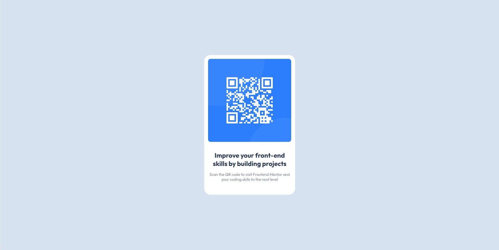

# Frontend Mentor - QR code component solution

This is a solution to the [QR code component challenge on Frontend Mentor](https://www.frontendmentor.io/challenges/qr-code-component-iux_sIO_H). Frontend Mentor challenges help you improve your coding skills by building realistic projects. 

## Table of contents

- [Overview](#overview)
  - [Screenshot](#screenshot)
  - [Links](#links)
- [My process](#my-process)
  - [Built with](#built-with)
  - [What I learned](#what-i-learned)
  - [Useful resources](#useful-resources)
- [Author](#author)

## Overview

### Screenshot

### Links

- Solution URL:

## My process
For this project first I created the content first (the card) and then with the card created I worked on the position.

### Built with

- HTML5 
- CSS

### What I learned

border-radius: propriedade CSS que permite definir bordas arredondadas;
The impact of the display: flex, where the child divs do not behave as a block content and starts to behave as a flex item, where there a lot of options of how to organize the flex items.

### Useful resources

- [How well do you know CSS display?](https://chenhuijing.com/blog/how-well-do-you-know-display/) - This helped me to understand how the CSS display works.
- [CSS Flexbox Fundamentals Visual Guide](https://medium.com/swlh/css-flexbox-fundamentals-visual-guide-1c467f480dac) - This helped me to understand how the flux display works.

## Author
- Frontend Mentor - [@yourusername](https://www.frontendmentor.io/profile/yourusername)

